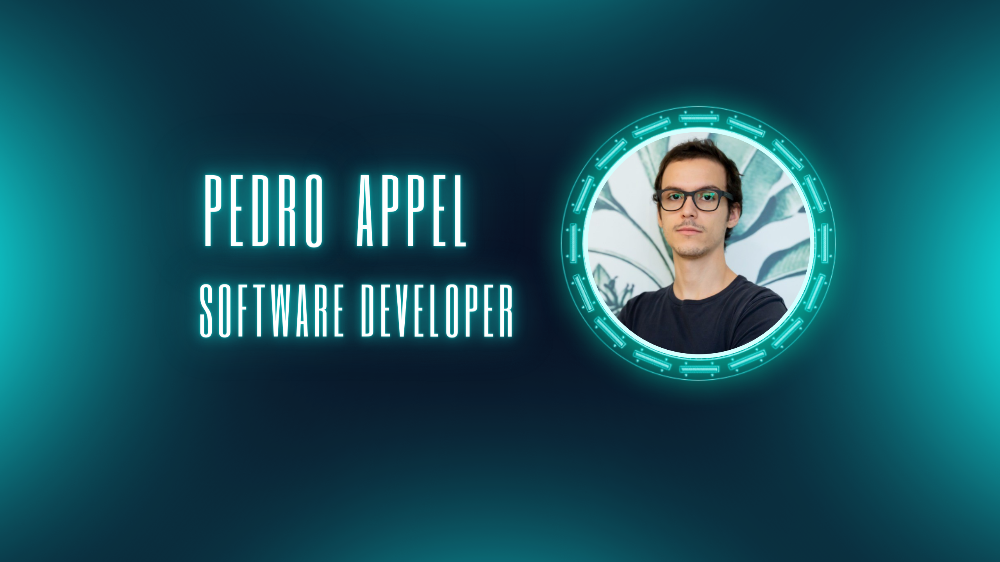

#### Young and amused with technology, always learning more and willing to evolve into a better version of me. Love to learn new languages and technologies. Graduated in Computer Science, Quantum inthusiastic and passionated with good and clean codes. Always seeking to work with difficulties so I can be one step ahead to being a inspiring professional. I enjoy sharing experiences with my colleagues, teaching and also learning from them.

## Some of my experience:

Worked most of my time in the bank industry in diverse areas such as:

### Authentication: 

* Implementation of web services for authentication flow of internal and external employees.
* Implementation of SPI`s using oAuth2 protocol to authenticate client to the govern site.

### Cryptography

* Creation, refactorization, reactive and proactive suport in Cryptography libraries for the hole company
* Development of cryptograms to use with combination with JWT and JWK tokens

### Cloud Migration

* Development and implemantation of IaC to migrate a major bank infrastructure form onPrem to Cloud
* Development of microsservices, lambdas, monoliths to orchestrate all payments flow from a major US bank

#### Also worked in some web pages as a freelancer using TypeScript in the NestJS framework

## Main Skills:

-  
-  
-  
-  
-  
-  
-  
-  
-  
-  

### Alongside with my work I’m currently working on some personal projects such as a Blockchain service for e-prescriptions.

- [Backend](https://github.com/Pedro-Appel/bbs-prescription-blockchain)
- [What is supposed to be the mobile](https://github.com/Pedro-Appel/bbs-prescription-mobile)
- [Still Working on the Infra...](https://github.com/Pedro-Appel/bbs-prescription-infrastructure)

### I’m currently learning DevSecOps and CyberSecurity

### I would love to collaborate on any project related to security/cryptography
📫 If you have any comments on my work, need any help, want to collaborate reach me on my email: appel.pedro@hotmail.com
